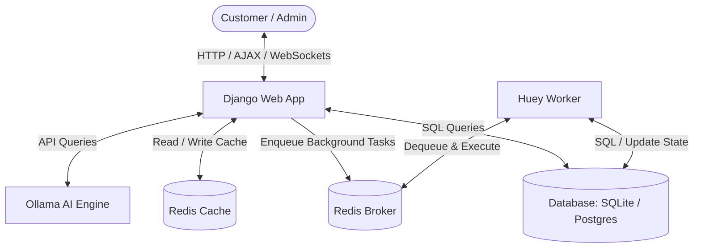
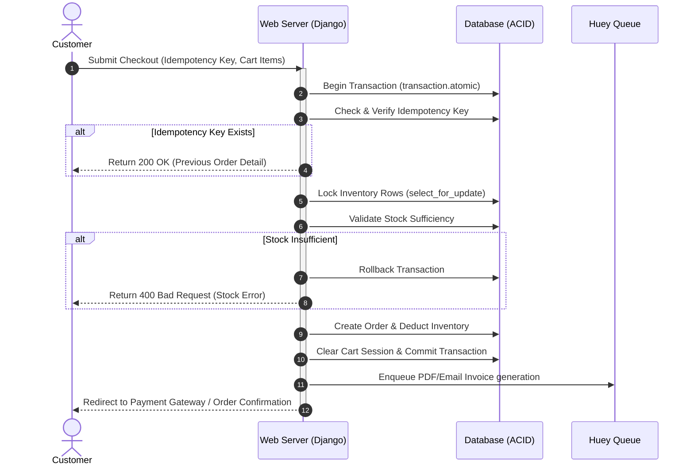
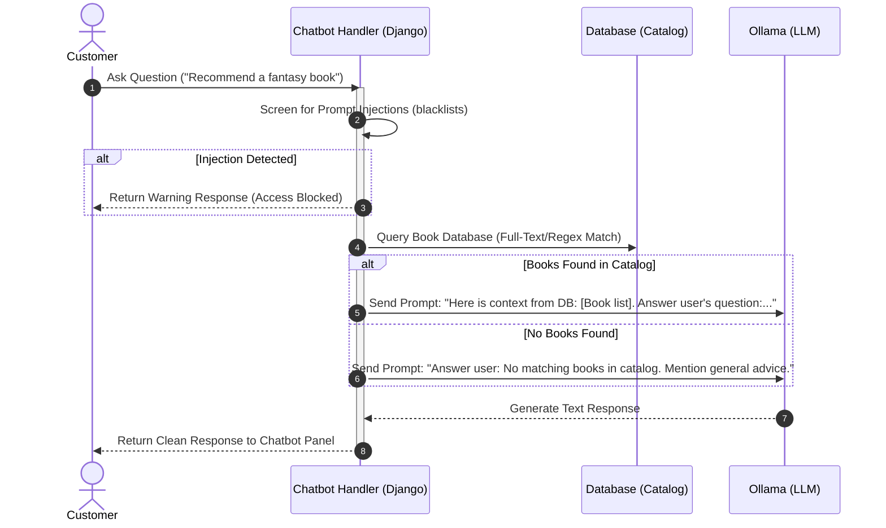

# Bookie System Architecture

This document describes the high-level architecture, service components, and operational data flows of the **Bookie** bookstore application.

---

## 1. System Overview

Bookie is structured as a decoupled multi-service application containerized via Docker Compose. It leverages a clean separation of concerns between web requests, persistent databases, caching layers, background task workers, and AI services.

---

## 2. Component Breakdown

### Django Web Application
* **Role:** Serves user requests, handles routing, views, authentication, RBAC, session management, and rendering of Django HTML templates.
* **Stack:** Django 6.1 (Python 3.12), Gunicorn (Production application server), WhiteNoise (Static asset pipeline).
* **Integrations:** Communicates with Redis for caching, PostgreSQL/SQLite for data persistence, Huey for task management, and Ollama for chatbot LLM capabilities.

### Persistent Database
* **Role:** Relational database storing books, categories, users, roles, cart caches, orders, ratings, and audit records.
* **Stack:** SQLite (Development & Testing), PostgreSQL (Production).
* **Guarantees:** Structured relationships, unique constraints (e.g. `idempotency_key`), and transactional atomicity via ACID compliance.

### Redis (Cache & Task Broker)
* **Role:** Shared cache storage and background task message broker.
* **Stack:** Redis.
* **Caching Strategy:** Network-First or Cache-Aside for highly requested pages like home catalogs or dashboard totals.
* **Broker:** Functions as a FIFO queue storing serialized execution parameters for Huey workers.

### Huey Background Worker
* **Role:** Asynchronous task processor.
* **Stack:** Huey worker process.
* **Executed Tasks:**
  * PDF generation of billing receipts.
  * System email dispatch (order completions, stock dips, customer registrations).

### AI Engine (Ollama)
* **Role:** Hosts the LLM models providing natural language chatbot answers and recommendation sentiment scanning.
* **Stack:** Ollama running the `Qwen` or compatible lightweight text model.

---

## 3. Core Data & Operational Flows

### Concurrency-Safe Checkout & Order Flow

During ordering, stock levels must remain accurate even under concurrent load. The sequence below shows the database locking mechanism:

### AI Chatbot Retrieval-Augmented Flow (DB-First)

To prevent chatbot hallucinations and recommend only real books in stock, the chatbot query follows a DB-First validation strategy:

