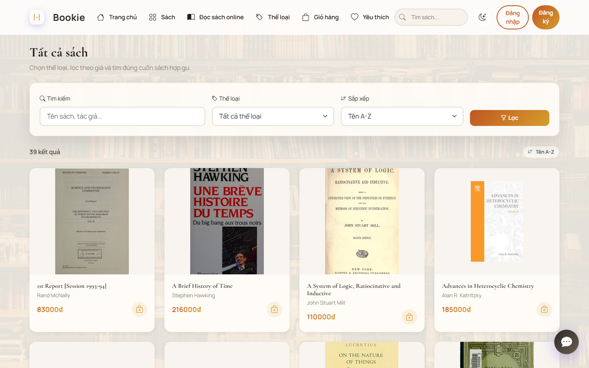
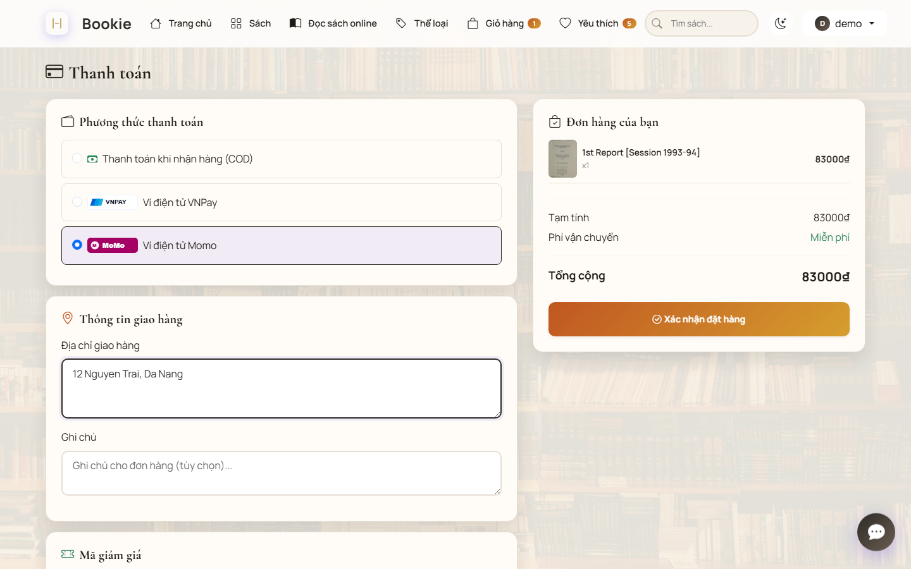
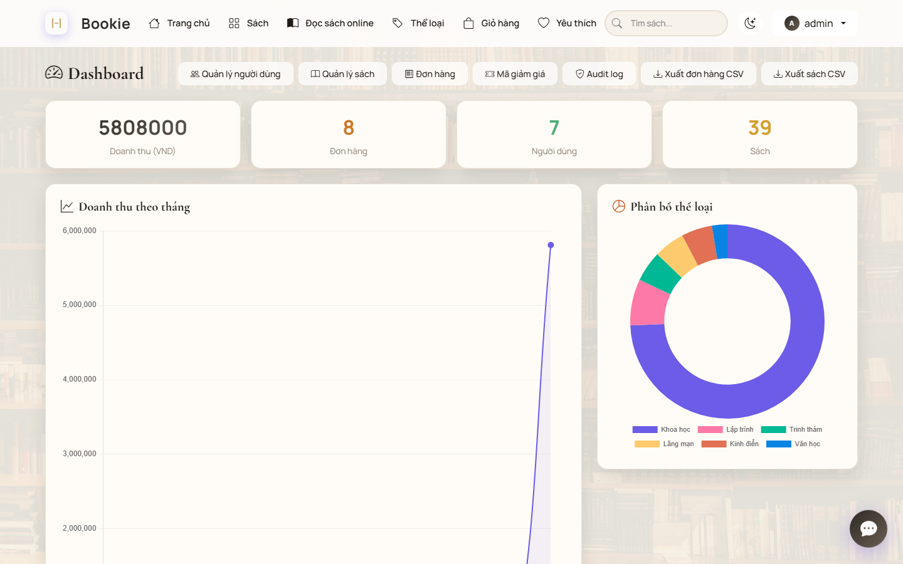

# Bookie - Django E-commerce Bookstore

[](https://github.com/vcongggggg/bookie-bookstore/actions/workflows/ci.yml)


Bookie is a production-oriented Django bookstore project featuring full e-commerce workflows, an admin dashboard, an offline PWA ebook reader, background tasks, Redis caching, JSON APIs, and security-focused checkout/payment flows.

The active implementation lives in [`Project/`](Project/). The old root-level Django tree was removed so `Project/` remains the single source of truth.

## Highlights

- **Complete e-commerce flow:** catalog search/sorting, category filters, interactive cart, coupon discounts, checkout, order history, wishlist, ratings, and user profiles.
- **Portfolio-grade backend details:** atomic checkout transactions, idempotency keys, payment state transitions, duplicate transaction protection, and owner-only order access.
- **PWA ebook reader:** root-scoped service worker, offline reading support, bookmarking, and reading progress.
- **Admin/RBAC dashboard:** Customer, Support, Staff, Manager, and Admin roles with audit logs for sensitive dashboard actions.
- **AI assistant:** database-grounded chatbot/recommendation behavior with prompt-injection guardrails.
- **Operations:** Docker Compose with Django, PostgreSQL, Redis, Huey worker, Gunicorn, WhiteNoise, health probes, and structured logs.
- **Quality gates:** Django tests, Playwright baseline, `pip-audit`, `bandit`, and coverage checks.

## Screenshots

| Home | Catalog |
| :---: | :---: |
|  |  |

| Checkout | Dashboard |
| :---: | :---: |
|  |  |

More screenshots are available in [docs/screenshots](docs/screenshots/).

## Documentation

| Document | Purpose |
| :--- | :--- |
| [Project README](Project/README.md) | Main technical overview, stack, quick start, demo accounts. |
| [Architecture](ARCHITECTURE.md) | Service architecture and core data flows. |
| [API Reference](API.md) | `/api/v1/...` JSON endpoint documentation. |
| [Security Review](SECURITY_REVIEW.md) | Implemented controls, tested risks, and remaining security gaps. |
| [Deployment Guide](DEPLOYMENT.md) | Docker, Render/Railway/VPS notes, env vars, health probes. |
| [AI Security](AI_SECURITY.md) | Chatbot guardrails and prompt-injection notes. |
| [Testing Workflow](TESTING.md) | Local and CI testing strategy. |
| [Upgrade Plan](BOOKIE_FULLSTACK_CV_UPGRADE_PLAN.md) | Portfolio improvement roadmap and CV bullets. |

## Current Verification

Latest local verification on 2026-06-21:

```powershell
cd Project
python manage.py check
python manage.py test books
npm.cmd run test:e2e
npm.cmd run screenshots
docker compose config --quiet
docker compose build web worker
docker compose up -d --force-recreate web worker
curl.exe -I http://127.0.0.1:8000/
curl.exe -s http://127.0.0.1:8000/health/live/
curl.exe -s http://127.0.0.1:8000/health/ready/
```

Current baseline: `77 backend tests OK`; Playwright `18 passed, 2 skipped`; Docker web/worker build passed; Docker home returned `200 OK`; health live/ready returned healthy JSON.

## Run Locally

From `Project/`:

```powershell
copy .env.example .env
python manage.py migrate
python manage.py seed_fake_data --reset-demo
python manage.py runserver
```

Docker:

```powershell
docker compose up --build -d
docker compose exec web python manage.py migrate
docker compose exec web python manage.py seed_fake_data --reset-demo
```

Health checks:

```powershell
curl.exe http://127.0.0.1:8000/health/live/
curl.exe http://127.0.0.1:8000/health/ready/
```

---

For installation details, Docker usage, and demo credentials, see [Project/README.md](Project/README.md).
